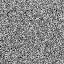
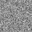
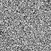
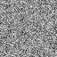
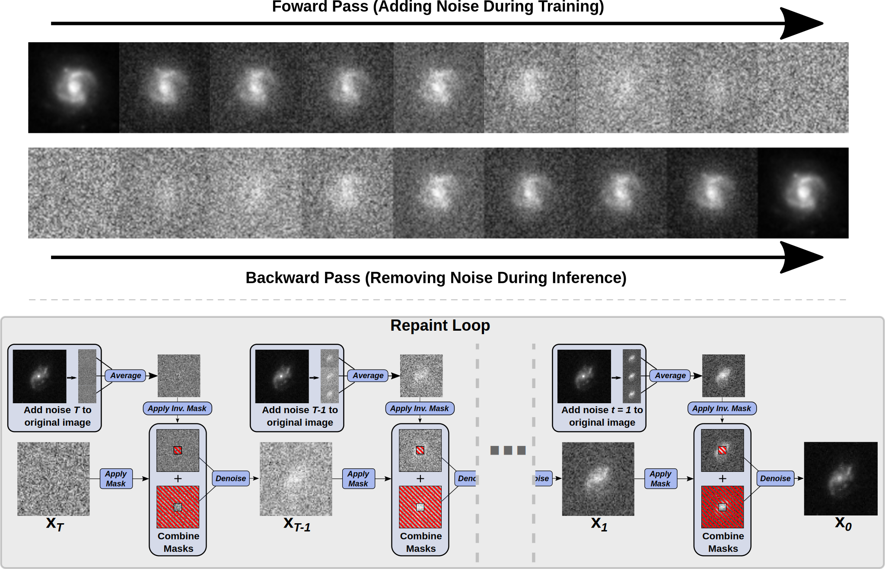
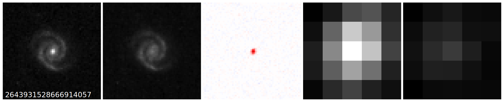
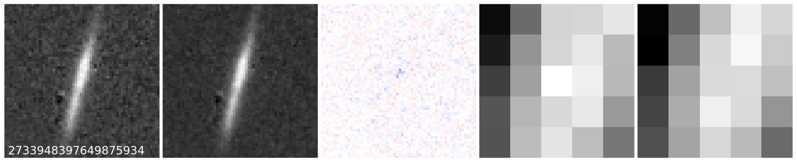
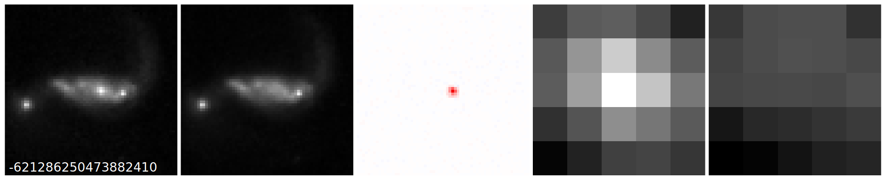

# Astro-Repaint

This code accomponies the paper:

**Active galactic nuclei identification using diffusion-based inpainting of Euclid VIS images**

*Euclid Collaboration: Stevens et al. (2025)*

[Arxiv: 2503.15321](https://arxiv.org/abs/2503.15321) | [Euclid Q1 A\&A Special Issue](https://www.aanda.org/component/toc/?task=topic&id=2247) | [Euclid Q1 Data Release](https://www.euclid-ec.org/science/q1/)

   

---

Large parts of this codebase are the result of combining and streamlining the [Guided Diffusion]() and  [Repaint](https://github.com/andreas128/RePaint) repositories and so credit must go to the respective developers for most of the training and inpainting pipeline.

---

## 1. Creating the Data

Cutouts are stored as NumPy arrays (.npy), each containing -bs sources per file.  
Each array stores the raw VIS pixel values for its cutouts.

*Euclid Q1 VIS tiles are available to download at: https://eas.esac.esa.int/sas/ .The tiles will be saved in the form `EUC_MER_BGSUB-MOSAIC-VIS_TILE#########- ... .fits`, where `#########` will be replaced with the respective Tile ID.*

Given a FITS table containing object ID, RA, DEC, and Tile ID values, batches of .npy files can be created with:
````bash
python create_batches.py -c subset_id_tiles.fits -bs 1024 -p 32 -td "tiles" -bd "data"
````

This produces:

- .npy batch files containing the image cutouts  
- batch_sources_full.json — maps batch filenames to source IDs  
- missing_tiles.txt — lists unavailable or missing tiles  
- image_errors.csv — logs failed or corrupted cutouts  

To process a single tile only, add the -t argument:

````bash
python create_batches.py -t 102157953 -c subset_id_tiles.fits -bs 1024 -p 32 -td "tiles" -bd "data"
````

⚠️ **Note**: If a tile contains artefacts (e.g. solar interference), all cutouts in that batch will be affected. Single-tile batches are recommended for inference or testing only.

The input parameters for the create_batches script are the following:

  - **c**: (*catalogue*) The fits catalogue with all required sources (required).
  - **bs**: (*batchsize*) The number of images within each created .npy file.
  - **p**: (*processses*) The number of processes used to create the .npy files.
  - **td**: (*tile_dir*) The directory where all tiles are stored.
  - **bd**: (*batch_dir*) The directory where all .npy files will be saved.
  - **t**: (*tile*) If t is specified, only sources from that tile will be saved to .npy files.

---

## 2. Inpainting




The specific model used in the paper can be downloaded here:

Model weights (Google Drive): https://drive.google.com/file/d/1q6GFYnLUOyUPagZTozfX-zOk44a5vlje/view?usp=sharing

Save the downloaded file model_best.pt into: `training_tmp/`.

### Interactive Dashboard

You can perform interactive, one-click inpainting using our dashboard:

````bash
panel serve example.py
````

Then open your browser to: http://localhost:5006/example .

Each completed batch automatically saves a results file in: `repaint_data/`

This enables automatic continuation if the process is stopped. Changing dashboard parameters (e.g. number of iterations, inpaint mask size) creates distinct result files.

The dashboard operates on one .npy file at a time for easy inspection.  

### Inpainting CLI Script

To inpaint all data non-interactively via the command line, use:

````bash
python repaint.py --conf_path confs/galaxy.yml -t 60 -js 3 -jl 1 -is 5 -bs 16
````

This command also checkpoints progress after each iteration, allowing pause-and-resume inference.

The input parameters for the inpainting scripts are the following:

  - **conf_path**: Path to configuration file. 
  - **is**: (*inpaint_size*) The size of the square mask used for inpainting.
  - **t**: The number of inference timesteps. *Larger numbers will produce more resiliant outputs but will take longer per batch.*
  - **js**: (*jump_n_samples*) The number of resamples made in the repaint process (see repaint paper for details). *Larger numbers will produce more resiliant outputs but will take longer per batch.*
  - **jl**: (*jump_length*) The number of steps jumped before resampling. *Smaller numbers will produce more resiliant outputs but will take longer per batch.*
  - **bs**: (*batch_size*) The number of images to inpaint at once in an iteration. 
  
  ⚠️ **Note**: Memory is the main bottleneck for inference and so only increase the batchsize if you have sufficient GPU Memory.





---

## 3. Training the Model

To train a new model using the same parameters as in the paper:

````bash
export PYTHONPATH=.; python scripts/image_train.py --num_channels 32 --num_res_blocks 3 --learn_sigma True --dropout 0.3 --diffusion_steps 4000 --noise_schedule cosine --lr 1e-4 --batch_size 1 --image_size 64 --loss_function "1_over_pixel"
````

After training, update the model path for inpainting in `confs/galaxy.yml`, setting the `model_path` field to point to your newly trained model.


The specific input parameters we have added to the training script are the following:

  - **batch_size**: This batchsize corresponds to the number of .npy files being loaded in at one time for training. 
  - **image_size**: This is size of the cutouts inputted into the model. If this is smaller than the image sizes in the .npy files, they will be cropped from the centre of the cutouts.
  - **loss_function**: The loss function used during training.

  ⚠️ **Note**: All other model parameters are used specifically as shown in the OpenAI [Guided Diffusion](https://github.com/openai/guided-diffusion) and [Improved Diffusion](https://github.com/openai/improved-diffusion) repositories. The reader is encouraged to look at their documentation for further details on altering these parameters.


---

## 4. Notes

- The diffusion and inpainting pipelines correspond to Sections 2 - 3 of the Euclid paper.  
- The "1_over_pixel" loss corresponds to the normalised MSE + VLB hybrid described in Eq. (9) of the paper.  
- Data creation uses raw VIS pixel values (no rescaling), as detailed in Section 3.2 (Reconstruction Rescaling) of the paper.  
- Inpainting is implemented via the Repaint algorithm (Lugmayr et al. 2022), ensuring consistent conditioning between masked and unmasked pixels.

---

## Reference

If you use this code or model, please cite:

```
Euclid Collaboration: G. Stevens et al. (2025),  "Active galactic nuclei identification using diffusion-based inpainting of Euclid VIS images", Astronomy & Astrophysics, 2025.
```

or use the following bib entry:


````latex
@ARTICLE{Stevens2025Q1,
       author = {{Euclid Collaboration: Stevens}, G. and {Fotopoulou}, S. and {Bremer}, M.N. and others},
       title = {Euclid Quick Data Release (Q1) Active galactic nuclei identification using diffusion-based inpainting of Euclid VIS images},
      journal = {A\&A, in press (Euclid Q1 SI), \url{}},
     keywords = {Astrophysics - Astrophysics of Galaxies},
         year = 2025,
        month = oct,
          eid = {arXiv:2503.15321},
        pages = {arXiv:2503.15321},
archivePrefix = {arXiv},
       eprint = {2503.15321},
 primaryClass = {astro-ph.GA}
}
````


---
